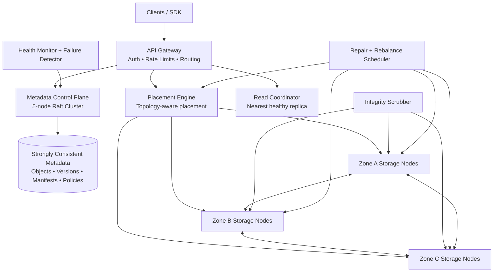

# Vault

Vault is a fault-tolerant distributed object storage prototype built for the Prompt-a-thon systems challenge. It stores real object bytes as immutable chunks on independent storage-node processes, commits versioned manifests through Raft, verifies every artifact with SHA-256, and repairs damage in the background.

The operator dashboard is part of the working system. Store or retrieve objects, take nodes offline, create a network partition, corrupt a replica, and run an integrity scan while watching the cluster remain available and repair itself.

For evaluator mapping across code quality, efficiency, accessibility, problem alignment, security, testing, and Google Cloud usage, see `EVALUATION.md`.

## Architecture



The API gateway provides routing, request-size enforcement, security headers, optional bearer authentication through `VAULT_API_KEY`, and per-client sliding-window rate limiting. The metadata control plane writes every catalog revision to a majority of five Raft members before it is considered committed. The placement and read paths are separate modules so topology decisions never leak into transport or metadata code.

## Why this design

Vault uses fifteen independent storage nodes across three zones and separate racks. In the normal app mode, those nodes run as separate HTTP processes on ports `9101-9115`; the gateway stores and retrieves object bytes through node APIs instead of touching every disk folder directly. Hot objects use `N=3`, `R=2`, `W=2`; cold objects use real Reed–Solomon `10+4` erasure coding. Files are divided into immutable 64 MB chunks, while the manifest records every chunk hash, placement, storage class, policy, and object version. Writes use a temporary file plus atomic rename inside the selected storage-node process. The manifest becomes visible only after a Raft majority commits it. A per-object lock serializes concurrent versions without blocking unrelated keys.

| Requirement | Vault implementation |
|---|---|
| Concurrent reads and writes | Per-key lock queues writes; reads and different keys proceed concurrently |
| Configurable durability | Per-object storage class, replication factor, read quorum, and write quorum |
| Node failures | Quorum reads continue if a storage-node process dies; scrubber replaces missing replicas on healthy nodes |
| Network partitions | Partitioned nodes are excluded from read and write quorums |
| Data corruption | SHA-256 per chunk/fragment, quarantine, retry, and reconstruction from valid data |
| Replica inconsistency | Immutable chunks and monotonically versioned, Raft-committed manifests |
| Cold-data efficiency | Reed–Solomon 10+4 reconstructs data from any ten valid fragments |
| Rebalancing | Verified copy-before-delete, minimal movement, topology awareness, and a move-rate limit |
| Metadata consistency | Five-node Raft control plane with majority commits and a monotonically increasing revision |
| Automatic repair | Background integrity scan runs every 15 seconds and after node recovery |
| Deletion lifecycle | Raft-committed tombstones, retention deadlines, and garbage collection |
| Storage overhead | Dashboard exposes logical bytes, physical bytes, and replication multiplier |

## Write and read guarantees

A write is accepted only after Vault splits the file into immutable chunks, hashes every chunk or fragment, places artifacts across independent zones and racks, reaches the configured durability quorum, and commits the versioned manifest through a majority of the five Raft members. The client receives success only after that manifest commit.

A read starts from the strongly consistent manifest, selects healthy artifacts by latency, verifies every hash, and never returns a corrupt artifact. A failed or corrupt copy is bypassed immediately and submitted to the priority repair scheduler. Cold chunks can be reconstructed from any ten of their fourteen fragments.

No object is marked fully healthy unless its artifacts span the required failure zones. Rebalancing copies and verifies a new artifact before removing an old one. Deletes create tombstones first; physical chunks remain until their retention deadline and a garbage-collection pass.

## Run locally

Requirements: Node.js 20 or newer. Vault has no third-party runtime dependencies.

```bash
npm start
```

`npm start` launches the API gateway plus fifteen managed storage-node HTTP processes. Use `npm run start:local` only when you want the compact single-process fallback for debugging.

Open `http://localhost:8080`. Click **Load demo data**, then use the **Failure lab**. The best judging flow is:

1. Load demo data and download one object to prove retrieval.
2. Fail a storage node and download the object again to prove availability.
3. Corrupt a replica and run an integrity scan.
4. Show the repaired count, recovery duration, replica placement, and audit stream.
5. Heal all nodes and show the cluster returning to full health.

For a command-line proof of independent storage nodes, stop one managed storage process during the demo and refresh the dashboard. Vault marks that node as partitioned and continues serving objects from quorum replicas.

You can also run the containerized demo with a readiness health check:

```bash
docker compose up --build
```

## Verify

```bash
npm run verify
npm run test:coverage
npm run audit
```

`npm run verify` runs both syntax checks and the full test suite. The additional commands emit native coverage metrics and verify the reproducible lockfile dependency graph.

The test suite verifies zone-aware replication, node-failure availability, managed process recovery before read failure, checksum repair, concurrent versions, unsafe-policy rejection, Raft majority behavior, Reed–Solomon recovery from four missing fragments, cold-data repair, tombstone garbage collection, and S3-style raw object routes.

## API

| Method | Route | Purpose |
|---|---|---|
| `GET` | `/api/health` | Readiness probe with storage-node and Raft-majority health |
| `GET` | `/api/status` | Cluster, node, policy, metrics, and Google Cloud status |
| `GET` | `/api/objects` | List objects and replica health |
| `POST` | `/api/objects` | Store base64 data as replicated hot or 10+4 erasure-coded cold chunks |
| `GET` | `/api/objects/:key` | Retrieve and verify bytes using nearest healthy artifacts |
| `DELETE` | `/api/objects/:key` | Commit a tombstone with a configurable retention period |
| `PUT` | `/s3/:bucket/:key` | Store raw object bytes through an S3-style path |
| `GET` | `/s3/:bucket/:key` | Retrieve raw object bytes with `ETag` and version headers |
| `HEAD` | `/s3/:bucket/:key` | Read object metadata without the body |
| `DELETE` | `/s3/:bucket/:key` | Tombstone an object through an S3-style path |
| `PATCH` | `/api/nodes/:id` | Set `healthy`, `offline`, or `partitioned` state |
| `POST` | `/api/faults/corrupt` | Inject replica corruption for a controlled demo |
| `POST` | `/api/integrity-scan` | Verify checksums and repair replicas |
| `POST` | `/api/rebalance` | Restore balanced, zone-aware placement |
| `POST` | `/api/garbage-collect` | Purge objects whose tombstone retention period has expired |

## Google Cloud deployment

Vault includes a production container and Cloud Build pipeline for Cloud Run. When `GCS_MIRROR_BUCKET` is configured, every committed object is also mirrored to Google Cloud Storage through the Cloud Run service identity. Give that service account `roles/storage.objectCreator` on the bucket.

```bash
gcloud builds submit --config cloudbuild.yaml \
  --substitutions=_REGION=asia-south1,_REPOSITORY=vault,_BUCKET=YOUR_BUCKET
```

Cloud Run's writable filesystem is ephemeral, so the local node fabric demonstrates the replication engine while the GCS mirror supplies durable disaster recovery across container restarts. A production deployment would run every storage node and Raft voter as an independently failing regional service backed by persistent disks.

## Production boundary

This repository is intentionally submission-sized and dependency-light. It already runs independent storage-node HTTP processes and exposes S3-style object routes. For a production rollout, the same module boundaries map to separate deployments: one API gateway service, five networked Raft voters, and independent storage-node services backed by persistent disks in different zones. The current implementation keeps the Raft voters inside the gateway process to stay small enough for the hackathon repository limit while still enforcing majority metadata commits and versioned manifests.

## Security and accessibility

The server validates object keys, policies, request size, node state, and JSON input. It prevents path traversal, emits a restrictive Content Security Policy, escapes filenames, and never executes uploaded content. The interface uses semantic landmarks, keyboard-accessible controls, focus states, labels, status announcements, and responsive layouts.

## Repository constraints

Generated object data is ignored by Git. The repository contains source and deployment files only, stays far below the 10 MB submission limit, and is intended to be submitted from one public branch.
